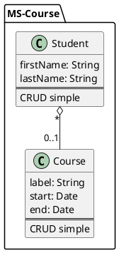

# MS-COURSE

Micro service pour gérer les étudiants et les formations.

## Dépendances

- Spring Boot
- Spring Data MongoDB
- Spring Web
- Lombak
- Actuator
- Docker

## Installation

- Cloner le projet
- Démarrez la base de données MongoDB avec Docker `docker-compose up -d`
- Lancer le projet avec la commande `mvn spring-boot:run`

## Schema de la base de données

## API

### Documentation

#### StandAlone :

- Swagger : `http://localhost:8081/api/courses/docs`
- Health : `http://localhost:8081/api/courses/status/health`

##### Avec Gateway :

Si vous utilisez la gateway, que ce soit en mode [dev](https://github.com/Admiralis/dev_stack) ou en mode [prod](https://github.com/Admiralis/admiralis), l'API sera accessible sur le port 80.Si l'API est sur un autre serveur, remplacer `localhost` par l'adresse du serveur.

- Swagger : `http://localhost/api/courses/docs`
- Health : `http://localhost/api/courses/status/health`

