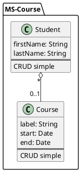

# MS-COURSE

Micro service pour gérer les étudiants et les formations.

## Dépendances

- Spring Boot
- Spring Data MongoDB
- Spring Web
- Lombak
- Docker

## Installation

- Cloner le projet
- Démarrez la base de données MongoDB avec Docker `docker-compose up -d`
- Lancer le projet avec la commande `mvn spring-boot:run`

## Schema de la base de données



## API

### Course

| Méthode | URL            | Description |
| --- |----------------| --- |
| GET | /api/courses | Récupérer la liste des formations |
| GET | /api/courses/{id} | Récupérer une formation |
| POST | /api/courses | Créer une formation |
| DELETE | /api/courses/{id} | Supprimer une formation |

#### Exemples de requêtes

#### GET /api/course

Retournera :

```json
[
    {
          "id": "5f9f9f9f9f9f9f9f9f9f9f9f",
          "label": "POE Java",
          "startDate": "2023-01-01",
          "endDate": "2023-03-31"
    },
  {
          "id": "5f9f9f9f9f9f9f9f9f9f9f9f",
          "label": "POE Angular",
          "startDate": "2023-03-01",
          "endDate": "2023-06-30"
    }
]
```

#### POST /api/course

Tous les champs sont optionnels sauf le label.
Ils seront passés en `null` si non remplis.

```json
{
    "label": "POE Java",
    "startDate": "2023-01-01",
    "endDate": "2023-03-31"
}
```

### Student

| Méthode | URL            | Description |
| --- |----------------| --- |
| GET | /api//students | Récupérer la liste des étudiants |
| GET | /api/students/{id} | Récupérer un étudiant |
| POST | /api/students | Créer un étudiant |
| DELETE | /api/students/{id} | Supprimer un étudiant |

#### Exemples d'objets

#### GET /api/students

Retourne l'objet complet et peuple la relation avec le Courses si présent

```json
{
  "id": "5f9f9f9f9f9f9f9f9f9f9f9f",
  "firstName": "John",
  "lastName": "Doe",
  "courses": {
      "id": "5f9f9f9f9f9f9f9f9f9f9f9f",
      "label": "Java",
      "startDate": "2023-01-01",
      "endDate": "2023-03-31"
    }
}
```

#### POST /api/students

```json
{
  "firstName": "John",
  "lastName": "Doe",
  "course" : {
    "id": "5f9f9f9f9f9f9f9f9f9f9f9f"
  }
}
```


